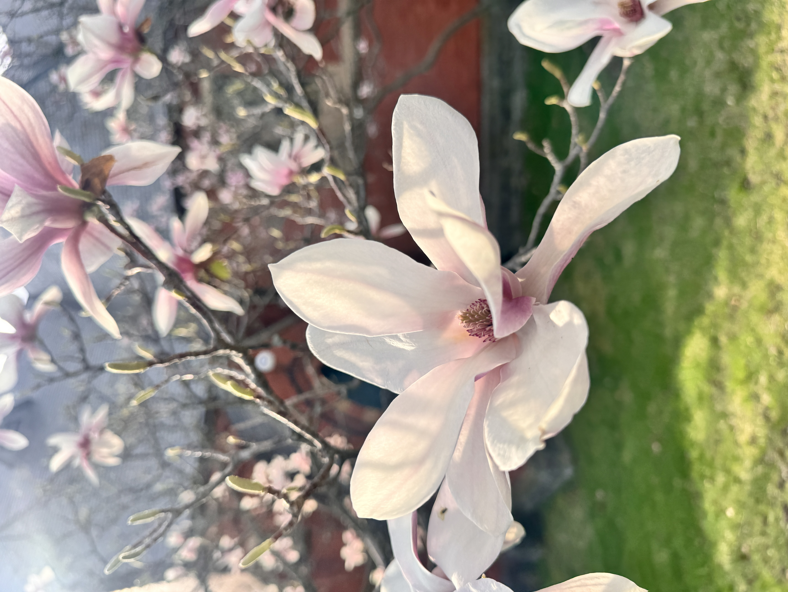
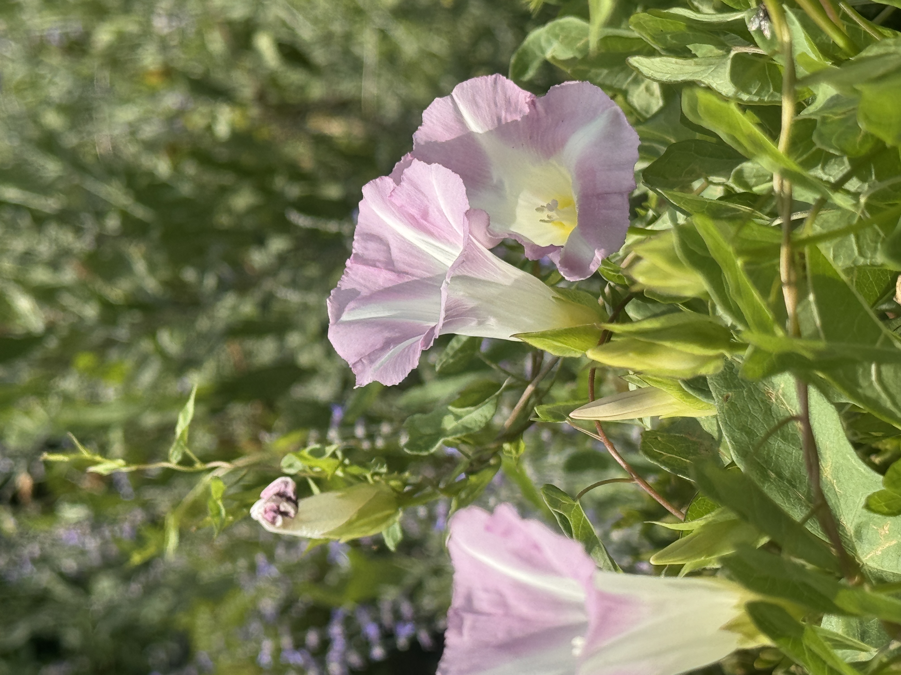

  

  

### 🗽 About Me

I’m a New Yorker, born and raised, who loves breaking things down and building them better. Growing up, I enjoyed tutoring others, which shaped my interest in educational technology and simplifying complex processes to make work more understandable and efficient. I also enjoy testing different AI models, exploring their capabilities, and understanding their weaknesses. Outside of tech, I love exploring nature and photographing different flower varieties.

|                                                            |                                                       |                                                            |
| :--------------------------------------------------------: | :---------------------------------------------------: | :--------------------------------------------------------: |
|  |  |  |
|                  Magnolias in Ithaca, NY                   |     Rhesus Macaques in Kam Chan Country Park, HK      |            Morning Glorys in Dearborn, Michigan            |

### 🛠️ Tech Stack

  
  
  
  
  
  
  
  
  
  
  
  
  
  
  
  
  
  
  
  
  
  
  
  
  
  
  
  
  

### 🔗 Connect With Me

  
  

### 📊 GitHub Stats

  

### 💭 Dev Quote

  

